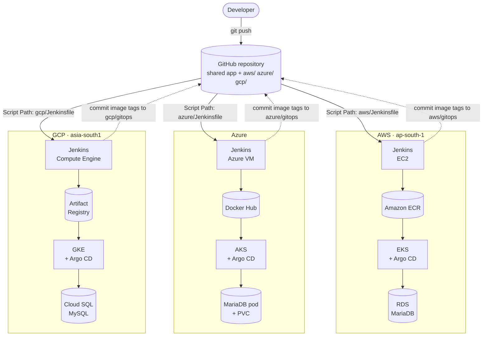
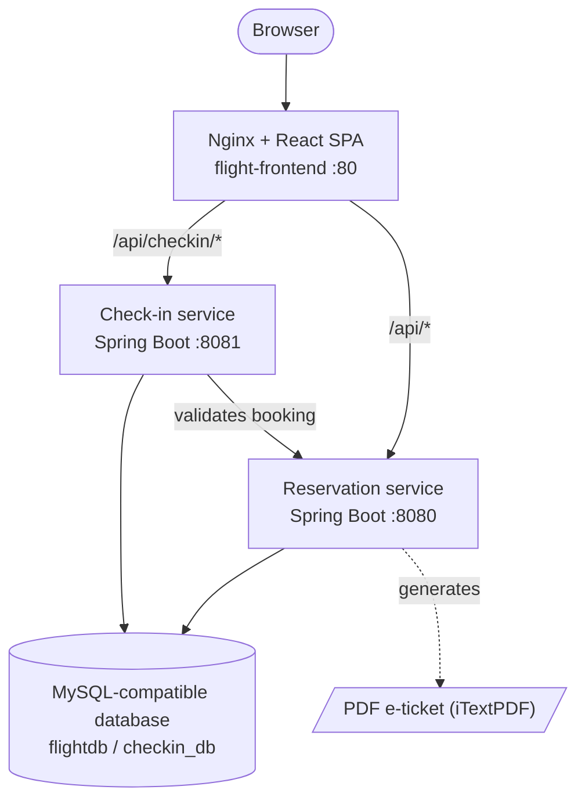
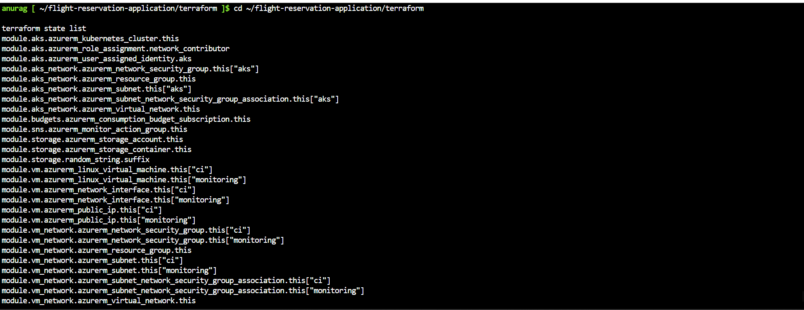

# ✈️ Flight Reservation System — Multi-Cloud DevOps (AWS · Azure · GCP)

One **flight booking and check-in platform** (React + two Spring Boot microservices) shipped to **three clouds** with the same DevOps toolchain: **Terraform** for infrastructure, **Jenkins** for CI, **SonarQube** for code quality, **Argo CD** for GitOps delivery to Kubernetes (**EKS · AKS · GKE**), and **Prometheus + Grafana** for observability.

The application code exists **once** at the repository root. Each cloud has its own folder — `aws/`, `azure/`, `gcp/` — holding that cloud's Terraform, Jenkins pipeline, Kubernetes manifests, monitoring values and deployment guide.

<p align="center">
  
</p>

<p align="center">
  
  
  
  
  
  
  
  
  
  
  
  
  
  
</p>

> **What "multi-cloud" means here.** The same application deploys to AWS, Azure *or* GCP through equivalent but **independent** stacks: each edition has its own cluster, database, registry and pipeline. It is **not** a single active-active deployment spanning the clouds — see the [roadmap](#roadmap) for ideas in that direction.

---

## Table of contents

- [At a glance](#at-a-glance)
- [Architecture](#architecture)
- [Repository layout](#repository-layout)
- [Tools used](#tools-used)
- [Screenshots](#screenshots)
- [CI/CD pipelines](#cicd-pipelines)
- [GitOps deployment](#gitops-deployment)
- [Infrastructure (Terraform)](#infrastructure-terraform)
- [Monitoring & alerting](#monitoring--alerting)
- [Features](#features) · [Tech stack](#tech-stack) · [API reference](#api-reference)
- [Run locally](#run-locally)
- [Deploy to a cloud](#deploy-to-a-cloud)
- [Security notes](#security-notes)
- [Differences between the editions](#differences-between-the-editions)
- [Roadmap](#roadmap)
- [Author](#author)

---

## At a glance

| | **AWS** | **Azure** | **GCP** |
|---|---|---|---|
| **Region** | `ap-south-1` (Mumbai) | `canadaeast` (VMs) · `australiasoutheast` (AKS) — configurable | `asia-south1` (Mumbai) |
| **Kubernetes** | Amazon EKS 1.35 · 2 × `c7i-flex.large` · private API endpoint | Azure AKS 1.35 | GKE zonal, private nodes + private endpoint · 2 × `e2-standard-2` |
| **Database** | RDS MariaDB 10.11 (private, encrypted) | MariaDB 11.8 **in the cluster** (PVC) | Cloud SQL for MySQL 8.4 (private IP) |
| **Image registry** | Amazon ECR (3 repositories) | Docker Hub | Artifact Registry (1 repository, 3 images) |
| **CI** | Jenkins on EC2 · 10 stages | Jenkins on an Azure VM · 7 stages + post actions | Jenkins on Compute Engine · 10 stages |
| **CD** | Argo CD — automated sync, self-heal, prune | same | same |
| **Observability** | kube-prometheus-stack + CloudWatch → SNS email | kube-prometheus-stack + Azure Monitor action group | kube-prometheus-stack + Cloud Monitoring email alerts |
| **IaC** | Terraform ≥ 1.6 · AWS provider 6.66.0 · 11 modules | Terraform ≥ 1.6 · azurerm 4.81.0 · 6 wired modules | Terraform ≥ 1.6 · google ~> 7.30 · 11 modules |
| **Screenshots** | 22 | 16 | *not captured yet* ([checklist](docs/screenshots/gcp/README.md)) |
| **Edition guide** | [`aws/README.md`](aws/README.md) | [`azure/README.md`](azure/README.md) | [`gcp/README.md`](gcp/README.md) |

---

## Architecture

### One codebase, three delivery targets



Every Jenkins pipeline ends the same way: it commits the new image tag into **its own cloud's** `gitops/` folder, and the Argo CD running in that cloud's cluster picks the change up and rolls it out.

### The application (identical on every cloud)



The frontend is the browser's only entry point. Nginx reverse-proxies:

| Path | Target |
|---|---|
| `/api/checkin/*` | `flight-checkin-service:8081` |
| `/api/*` | `flight-reservation-service:8080` |
| everything else | React static build (SPA fallback to `index.html`) |

### Service mapping

| Capability | AWS | Azure | GCP |
|---|---|---|---|
| Network | VPC, public/private/database subnets, NAT Gateway | Two VNets (VMs, AKS), NSGs | Custom VPC, VM + GKE subnets, Cloud NAT, Private Service Access |
| Firewalling | Security groups | Network security groups | VPC firewall rules (network tags) |
| Identity for VMs/nodes | IAM roles / instance profiles | Managed identities | Service accounts (no keys) |
| CI + admin VMs | EC2 × 2 | Linux VMs × 2 | Compute Engine × 2 |
| Kubernetes | EKS | AKS | GKE |
| Database | RDS MariaDB 10.11 | MariaDB 11.8 pod + PVC | Cloud SQL MySQL 8.4 |
| Object storage | S3 | Storage account + container | Cloud Storage |
| Container registry | ECR | Docker Hub | Artifact Registry |
| Alerting | CloudWatch alarms → SNS email | Azure Monitor action group · subscription budget alerts | Cloud Monitoring alert policies → email channel |
| Cluster credentials | `aws eks update-kubeconfig` | `az aks get-credentials` | `gcloud container clusters get-credentials --internal-ip` |

---

## Repository layout

```
flight-reservation-multicloud/
├── frontend/                       # React + Vite SPA, Nginx Dockerfile + reverse-proxy config   (shared)
├── FlightReservationApplication/   # Spring Boot: users, flights, bookings, PDF tickets (:8080)  (shared)
├── FlightCheckInApplication/       # Spring Boot: check-in workflow (:8081)                       (shared)
│
├── aws/                            # AWS edition
│   ├── terraform/                  #   11 modules + helper scripts
│   ├── gitops/                     #   Kubernetes manifests synced by Argo CD
│   ├── monitoring/                 #   kube-prometheus-stack values + Grafana secret template
│   ├── docs/JENKINS-CREDENTIALS.md
│   ├── Jenkinsfile                 #   Jenkins Script Path: aws/Jenkinsfile
│   ├── argocd-application.yaml
│   ├── README.md · README-DEPLOYMENT.md
├── azure/                          # Azure edition (same shape; terraform/ has 6 wired modules, gitops/ includes MariaDB)
├── gcp/                            # GCP edition   (same shape; 11 Terraform modules)
│
├── docs/
│   ├── screenshots/                # app/ · aws/ · azure/ · gcp/   (every image used in the READMEs)
│   └── MERGE-NOTES.md             # what was merged, changed, excluded, and what to double-check
├── .gitignore                      # Terraform state, tfvars, real Kubernetes Secrets, build output
└── README.md
```

Why this shape: the three original projects had **byte-identical** application code, Dockerfiles and frontend config; only `application.properties` (and test config) differed. So the application lives once, and the parts that genuinely differ per cloud are kept side by side.

---

## Tools used

| Tool | Role | Where | Screenshots |
|---|---|---|---|
| **Terraform** | Provisions every cloud resource | AWS · Azure · GCP | [AWS, Azure](#infrastructure-as-code--terraform) |
| **Jenkins** | CI: build → scan → image → push → update GitOps | AWS · Azure · GCP | [AWS, Azure](#ci--jenkins) |
| **Maven (`mvnw`) + JDK 21** | Builds the Spring Boot services | all | [Azure CI VM](#tooling-on-the-vms-azure) |
| **npm + Vite + ESLint** | Builds / lints the React frontend | all | — |
| **SonarQube** | Static code analysis and quality gate | AWS, GCP (both services) · Azure (reservation) | [AWS](#code-quality--sonarqube) |
| **Docker** | Builds the three images | all | [Azure CI VM](#tooling-on-the-vms-azure) |
| **ECR · Docker Hub · Artifact Registry** | Image registry per cloud | AWS · Azure · GCP | — |
| **Argo CD** + Kustomize manifests | GitOps continuous delivery | all | [AWS, Azure](#cd--argo-cd) |
| **kubectl · Helm** | Cluster administration, installs the monitoring stack | all | [Azure admin VM](#tooling-on-the-vms-azure) |
| **Prometheus · Alertmanager** | In-cluster metrics and alert routing | all | [AWS](#prometheus) |
| **Grafana** | Dashboards | all | [AWS](#grafana) |
| **CloudWatch + SNS** | AWS-level alarms with email | AWS | [AWS](#cloudwatch) |
| **Azure Monitor action group + budgets** | Azure alert email and cost guardrail | Azure | — |
| **Cloud Monitoring** | GCP alert policies | GCP | — |
| **Nginx** | Serves the SPA and reverse-proxies the APIs | all | — |
| **aws · az · gcloud CLIs** | Cloud administration | AWS · Azure · GCP | [Azure `az`](#cloud-resources-provisioned) |
| **MariaDB / MySQL** | Application data | AWS (RDS) · Azure (pod) · GCP (Cloud SQL) | [AWS RDS](#database-contents--aws-rds) |

---

## Screenshots

> Everything below comes from the three original projects. **AWS and Azure have tooling screenshots; GCP has none yet** (its uploaded project only contained copies of the application screenshots) — see the coverage table and the [GCP checklist](docs/screenshots/gcp/README.md).

### Coverage at a glance

| Tool / area | AWS | Azure | GCP |
|---|:-:|:-:|:-:|
| Application UI | shared set (7) | own capture (6) | uses the shared set |
| Terraform | ✅ 2 | ✅ 2 | ⏳ |
| Cloud resources provisioned | ✅ 1 | ✅ 1 | ⏳ |
| Database contents | ✅ 1 | — | ⏳ |
| Jenkins | ✅ 1 | ✅ 3 | ⏳ |
| SonarQube | ✅ 3 | — | ⏳ |
| Argo CD | ✅ 1 | ✅ 2 | ⏳ |
| Prometheus | ✅ 4 | — | ⏳ |
| Grafana | ✅ 6 | — | ⏳ |
| Cloud-native alerting | ✅ 4 (CloudWatch) | — | ⏳ |
| Toolchain on the VMs | — | ✅ 2 | ⏳ |

✅ captured · — not captured · ⏳ to be added after deploying

### Application (shared UI)

<table>
  <tr>
    <td align="center"><br><sub><b>Login</b></sub></td>
    <td align="center"><br><sub><b>Register</b></sub></td>
    <td align="center"><br><sub><b>Profile</b></sub></td>
  </tr>
  <tr>
    <td align="center"><br><sub><b>Search &amp; book flights</b></sub></td>
    <td align="center"><br><sub><b>My bookings + PDF ticket</b></sub></td>
    <td align="center"><br><sub><b>Contact</b></sub></td>
  </tr>
</table>

<details>
<summary><b>Azure edition application captures</b> — the Azure project's own set (click to expand)</summary>

<br>

<table>
  <tr>
    <td align="center"><br><sub><b>Home</b></sub></td>
    <td align="center"><br><sub><b>Login</b></sub></td>
    <td align="center"><br><sub><b>Register</b></sub></td>
  </tr>
  <tr>
    <td align="center"><br><sub><b>Search flights</b></sub></td>
    <td align="center"><br><sub><b>Profile</b></sub></td>
    <td align="center"><br><sub><b>Contact</b></sub></td>
  </tr>
</table>

</details>

### Infrastructure as Code — Terraform

<table>
  <tr>
    <td align="center"><br><sub><b>AWS — <code>terraform init</code> &amp; <code>validate</code></b></sub></td>
    <td align="center"><br><sub><b>Azure — <code>terraform output</code> (cluster, resource groups, VM IPs)</b></sub></td>
  </tr>
  <tr>
    <td align="center"><br><sub><b>Azure — <code>terraform state list</code> (aks, budgets, sns, storage, vm, network)</b></sub></td>
  </tr>
</table>

### Cloud resources provisioned

<table>
  <tr>
    <td align="center"><br><sub><b>AWS — 2 EC2 VMs, EKS cluster (ACTIVE, v1.35), node group of 2</b></sub></td>
    <td align="center"><br><sub><b>Azure — <code>az resource list</code>: AKS, VMs, VNets, NSGs, storage, action group</b></sub></td>
  </tr>
</table>

### Database contents — AWS RDS

<p align="center">
  <br><sub><b>Bookings, flights and users written by the running application (Amazon RDS)</b></sub>
</p>

### CI — Jenkins

**AWS — pipeline #4 green across all 10 stages (8 min 44 s):**

<p align="center">
  
</p>

**Azure — pipeline run, stage view and build history:**

<table>
  <tr>
    <td align="center"><br><sub><b>Azure — all stages green, ending with Post Actions</b></sub></td>
    <td align="center"><br><sub><b>Azure — stage view (Backend Build log from the <i>original</i> pipeline run)*</b></sub></td>
  </tr>
  <tr>
    <td align="center"><br><sub><b>Azure — build history while debugging (#1–#4 failed first)</b></sub></td>
  </tr>
</table>

<sub>* The Azure stage-view capture shows the original Backend Build, which ran tests against a throw-away MySQL container. In this merged repository that stage builds with <code>-DskipTests</code> like AWS and GCP; the stage names are unchanged.</sub>

### Code quality — SonarQube

Both backends are analysed on every AWS pipeline run and pass the quality gate.

<table>
  <tr>
    <td align="center"><br><sub><b>Projects</b></sub></td>
    <td align="center"><br><sub><b>Reservation service</b></sub></td>
    <td align="center"><br><sub><b>Check-in service</b></sub></td>
  </tr>
</table>

### CD — Argo CD

**AWS — `flight-reservation` is Healthy and Synced (3 Deployments, 3 Services, ConfigMap, Namespace):**

<p align="center">
  
</p>

**Azure — application tree and sync details (includes the in-cluster MariaDB, PVC and init ConfigMap):**

<table>
  <tr>
    <td align="center"><br><sub><b>Azure — application tree, Healthy &amp; Synced</b></sub></td>
    <td align="center"><br><sub><b>Azure — sync details &amp; resource list*</b></sub></td>
  </tr>
</table>

<sub>* Captured from the original Azure repository, where the Argo CD path was <code>gitops</code>; in this repository it is <code>azure/gitops</code>.</sub>

### Monitoring & alerting

#### Prometheus

<table>
  <tr>
    <td align="center"><br><sub><b>Target health</b></sub></td>
    <td align="center"><br><sub><b><code>up</code> query — all scrape targets</b></sub></td>
  </tr>
  <tr>
    <td align="center"><br><sub><b>Application pods in <code>flight-reservation</code></b></sub></td>
    <td align="center"><br><sub><b>Pod CPU usage</b></sub></td>
  </tr>
</table>

#### Grafana

<table>
  <tr>
    <td align="center"><br><sub><b>Cluster networking (per namespace)</b></sub></td>
    <td align="center"><br><sub><b>Compute resources — pod</b></sub></td>
  </tr>
  <tr>
    <td align="center"><br><sub><b>Node CPU / memory</b></sub></td>
    <td align="center"><br><sub><b>Kubernetes API server</b></sub></td>
  </tr>
  <tr>
    <td align="center"><br><sub><b>Alertmanager overview</b></sub></td>
    <td align="center"><br><sub><b>CoreDNS</b></sub></td>
  </tr>
</table>

#### CloudWatch

Four alarms — Jenkins CPU, monitoring-VM CPU, RDS CPU, RDS free storage — all wired to an SNS email topic:

<p align="center">
  
</p>

<table>
  <tr>
    <td align="center"><br><sub><b>Jenkins VM CPU</b></sub></td>
    <td align="center"><br><sub><b>Monitoring VM CPU</b></sub></td>
    <td align="center"><br><sub><b>RDS CPU</b></sub></td>
  </tr>
</table>

### Tooling on the VMs (Azure)

Azure's Terraform `vm` module provisions both VMs; these captures show what was installed on each.

<table>
  <tr>
    <td align="center"><br><sub><b>CI VM — Java 21, Maven, Docker, Terraform, Azure CLI</b></sub></td>
    <td align="center"><br><sub><b>Admin / monitoring VM — kubectl, Kustomize, Helm, Argo CD CLI, Azure CLI</b></sub></td>
  </tr>
</table>

### GCP

No GCP tooling screenshots were part of the uploaded project yet. Capture yours after `terraform apply` using the checklist in [`docs/screenshots/gcp/`](docs/screenshots/gcp/README.md).

---

## CI/CD pipelines

**Common flow (every cloud):** checkout → build both backends (`mvn clean package -DskipTests`) → build the frontend → SonarQube analysis → build three Docker images → log in to the registry and push `:<BUILD_NUMBER>` → rewrite the `image:` lines in `<cloud>/gitops/*-deployment.yaml`, commit and push to `main` → Argo CD syncs the cluster.

Create one Jenkins *Pipeline from SCM* job per cloud and set **Script Path** to `aws/Jenkinsfile`, `azure/Jenkinsfile` or `gcp/Jenkinsfile`. The workspace root is the repository root, so each pipeline finds the shared application folders.

| | AWS — [`aws/Jenkinsfile`](aws/Jenkinsfile) | Azure — [`azure/Jenkinsfile`](azure/Jenkinsfile) | GCP — [`gcp/Jenkinsfile`](gcp/Jenkinsfile) |
|---|---|---|---|
| **Stages** | Verify AWS · Backend Build · Frontend Build · SonarQube Analysis · Docker Build · ECR Login · Tag Images · Push Images to ECR · Update GitOps · Docker Cleanup | Checkout · Backend Build · Frontend Checks (ESLint, non-blocking) · SonarQube Analysis · Docker Build · Push Images · Update GitOps · *post:* logout + prune | Verify GCP · Backend Build · Frontend Build · SonarQube Analysis · Docker Build · Artifact Registry Login · Tag Images · Push Images · Update GitOps · Docker Cleanup |
| **Registry auth** | VM IAM instance role (`aws ecr get-login-password`) | `dockerhub-creds` credential | VM service account (`gcloud auth print-access-token`) |
| **Tags pushed** | `:<BUILD_NUMBER>` | `:<BUILD_NUMBER>` and `:latest` | `:<BUILD_NUMBER>` |
| **SonarQube scope** | both backends | reservation service | both backends |
| **Jenkins credentials** | `sonarqube-token`, `github` | `dockerhub-creds`, `sonarqube-token`, `github` | `sonarqube-token`, `github` |
| **Edit before first run** | `GITHUB_REPO` in the Jenkinsfile | Docker Hub user in `azure/gitops/*-deployment.yaml` | `GITHUB_REPO` in the Jenkinsfile |

No cloud access keys are stored in Jenkins for AWS or GCP (instance role / service account). The AWS and GCP pipelines stop immediately with a clear message if `GITHUB_REPO` still holds the placeholder. Credential setup per cloud: `aws/docs/JENKINS-CREDENTIALS.md`, `azure/docs/JENKINS-CREDENTIALS.md`, `gcp/docs/JENKINS-CREDENTIALS.md`.

> Unit tests are **skipped in CI on all three clouds** for now (see the [roadmap](#roadmap)). The shared code keeps its test configuration on an in-memory H2 database, so no database container is needed when you enable them.

---

## GitOps deployment

Each cloud's `gitops/` folder is a Kustomize manifest set for the `flight-reservation` namespace, watched by that cluster's Argo CD through `<cloud>/argocd-application.yaml` (**automated sync, self-heal and prune**).

| Manifest | AWS / GCP | Azure |
|---|---|---|
| `namespace.yaml`, `*-deployment.yaml`, `*-service.yaml` | reservation `:8080`, check-in `:8081`, frontend `:80` (`LoadBalancer`) | same three services |
| `configmap.yaml` | JDBC URLs for the managed database, booking-service URL, frontend URL | — (settings are inline `env:` in the Deployments) |
| Database | none — services connect to RDS / Cloud SQL | `mariadb-deployment/-service/-pvc/-init-configmap.yaml` |
| `secret.example.yaml` | template for `DB_USERNAME` / `DB_PASSWORD` | template for `DB_ROOT_PASSWORD` |

Database credentials are a Kubernetes **Secret applied by hand** from the `secret.example.yaml` template. It is deliberately not listed in `kustomization.yaml` so Argo CD never overwrites it, and the root `.gitignore` keeps the real `secret.yaml` out of Git. Edit `repoURL` in each `argocd-application.yaml` to your repository before applying it.

```bash
kubectl apply -f <cloud>/argocd-application.yaml
argocd app get flight-reservation
argocd app sync flight-reservation
```

---

## Infrastructure (Terraform)

Each cloud's `terraform/` folder is split into modules wired together in `main.tf`. Copy `terraform.tfvars.example` to `terraform.tfvars` (git-ignored) and fill in your values.

<details open>
<summary><b>AWS</b> — <a href="aws/terraform"><code>aws/terraform</code></a> (11 modules)</summary>

| Module | Provisions |
|---|---|
| `vpc` | VPC `10.0.0.0/16`, public / private / database subnets across 2 AZs, Internet + NAT gateways, route tables |
| `security-groups` | Jenkins SG (SSH, Jenkins 8080, SonarQube 9000 — admin IP only), monitoring SG, RDS SG (3306 — VPC only) |
| `iam` | Jenkins role (ECR + CloudWatch agent), monitoring role, EKS cluster and node roles |
| `ec2-jenkins` / `ec2-monitoring` | VM1 (Docker, Jenkins, Maven, Java 21, SonarQube) and VM2 (AWS CLI, kubectl, Helm, Argo CD CLI, MariaDB client) |
| `eks` | EKS 1.35, private-only API endpoint, managed node group of 2 × `c7i-flex.large`, access entry for VM2 |
| `rds` | MariaDB 10.11 on `db.t3.micro`, gp3, encrypted, not publicly accessible |
| `s3` · `ecr` | Versioned, encrypted application bucket · three ECR repositories |
| `sns` · `cloudwatch` | Alerts topic + email · alarms: Jenkins CPU, monitoring CPU, RDS CPU, RDS free storage |

Helper scripts: `create-checkin-db.sh`, `install-argocd.sh`, `install-monitoring.sh`, plus the EC2 user-data scripts.
</details>

<details>
<summary><b>Azure</b> — <a href="azure/terraform"><code>azure/terraform</code></a> (6 wired modules)</summary>

| Module | Provisions |
|---|---|
| `network` (used twice) | Resource group, VNet and subnets — once for the VMs, once for AKS |
| `vm` | **CI VM** (Jenkins, Docker, Maven, Terraform, Azure CLI) and **monitoring/admin VM** (kubectl, Helm, Argo CD CLI, Azure CLI), each with public IP and NSG |
| `aks` | The AKS cluster with a configurable node VM size |
| `storage` | Storage account and container for shared artifacts |
| `sns` | Azure Monitor **action group** for email alerting (named `sns` for parity with AWS) |
| `budgets` | Monthly subscription budget with 80 % / 100 % notifications |

`modules/database` exists but is **not referenced** from `main.tf` — this edition runs MariaDB inside the cluster.
</details>

<details>
<summary><b>GCP</b> — <a href="gcp/terraform"><code>gcp/terraform</code></a> (11 modules)</summary>

| Module | Provisions |
|---|---|
| `apis` | Enables the required Google APIs |
| `network` | Custom VPC, VM + GKE subnets with secondary ranges, Cloud Router + NAT, Private Service Access for Cloud SQL |
| `firewall` | Admin-IP-only Jenkins/SonarQube/SSH rules, optional IAP SSH, internal traffic, control-plane webhook ports |
| `iam` | Service accounts for Jenkins, the monitoring VM and GKE nodes — least privilege |
| `compute-vm` (used twice) | VM1 (Docker, Jenkins, Maven, Java 21, Node 22, gcloud, SonarQube) and VM2 (gcloud, kubectl, Helm, Argo CD CLI, MySQL client); shielded VMs, OS Login |
| `gke` | Zonal, VPC-native, **private nodes and private endpoint**, Workload Identity, node pool of 2 × `e2-standard-2` |
| `cloudsql` | MySQL 8.4, **private IP only**, automated backups, creates `flightdb`, `checkin_db` and the app user |
| `gcs` · `artifact-registry` | Versioned bucket with public access prevention · Docker repository `flight-reservation-dev` |
| `notifications` · `cloud-monitoring` | Email channel · alert policies: Jenkins CPU, monitoring CPU, Cloud SQL CPU, Cloud SQL disk |

`backend.tf.example` shows how to move state to a Cloud Storage bucket.
</details>

---

## Monitoring & alerting

All three editions install **kube-prometheus-stack** (Prometheus, Grafana, Alertmanager, node-exporter, kube-state-metrics) *inside* the cluster with Helm, from the admin VM (VM2). Values files and a Grafana admin-secret template live in `<cloud>/monitoring/`.

```bash
helm repo add prometheus-community https://prometheus-community.github.io/helm-charts
helm repo update
kubectl create namespace monitoring --dry-run=client -o yaml | kubectl apply -f -
helm upgrade --install kube-prometheus-stack prometheus-community/kube-prometheus-stack \
  --namespace monitoring \
  --values <cloud>/monitoring/kube-prometheus-stack-values.yaml
```

`aws/terraform/scripts/install-monitoring.sh` and `gcp/terraform/scripts/install-monitoring.sh` wrap this for their clouds. On top of the in-cluster stack, each cloud has native alerting: **CloudWatch → SNS** (AWS), an **Azure Monitor action group** plus budget alerts (Azure), **Cloud Monitoring alert policies** (GCP).

---

## Features

**Traveller** — register / log in (JWT); search flights by origin, destination and date; book through a simulated payment step; view bookings and **download a PDF e-ticket**; view and update the profile; **online check-in** with baggage count, handled by a separate service.

**Admin** — separate admin login and profile; add and delete flights; add admin accounts and list admins.

**Platform** — stateless JWT auth shared by two independent Spring Boot services; the check-in service validates the booking (and that it belongs to the caller) by calling the reservation service; Nginx gives the browser a single origin (no CORS handling in the SPA); a fully automated build → scan → image → deploy flow with self-healing GitOps.

---

## Tech stack

| Layer | Technology |
|---|---|
| Frontend | React 19, Vite 6, React Router 7, Redux Toolkit, Axios, React Toastify |
| Reservation service | Java 21, Spring Boot 3.3.5, Spring Security, Spring Data JPA, JJWT, iTextPDF |
| Check-in service | Java 21, Spring Boot 3.3.5, Spring Security, Spring Data JPA, JJWT |
| Database | RDS MariaDB 10.11 · MariaDB 11.8 pod · Cloud SQL MySQL 8.4 |
| Containers | Docker · Nginx 1.29 (frontend) · Eclipse Temurin 21 JRE Alpine (backends, non-root user) |
| IaC | Terraform (modular, per cloud) |
| CI | Jenkins, Maven, npm, SonarQube Community |
| CD / GitOps | Argo CD, Kubernetes manifests + Kustomize |
| Monitoring | kube-prometheus-stack via Helm, plus CloudWatch / Azure Monitor / Cloud Monitoring |

---

## API reference

All endpoints except `register` and `login` require a JWT: `Authorization: Bearer <token>`.

**Users — `/api/users`** (reservation service)

| Method | Endpoint | Description |
|---|---|---|
| POST | `/register` | Register a user (public) |
| POST | `/login` | Authenticate and receive a JWT (public) |
| GET | `/{id}` | Get a user by ID |
| GET | `/userList` | List registered users |
| PUT | `/update/{id}` | Update a user's profile |

**Flights — `/api/flights`** (reservation service)

| Method | Endpoint | Description |
|---|---|---|
| POST | `/create` | Add a flight |
| GET | `/all` | List all flights |
| GET | `/search?origin=&destination=&departureDate=` | Search flights |
| PUT | `/update/{id}` | Update a flight |
| DELETE | `/delete/{id}` | Delete a flight |

**Bookings — `/api/bookings`** (reservation service)

| Method | Endpoint | Description |
|---|---|---|
| POST | `/book` | Create a booking |
| GET | `/user/{userId}` | List a user's bookings |
| GET | `/details/{bookingId}` | Get one booking |
| GET | `/download-ticket/{bookingId}` | Download the PDF e-ticket |

**Check-in — `/api/checkin`** (check-in service)

| Method | Endpoint | Description |
|---|---|---|
| POST | `/{bookingId}?numberOfBags=` | Check in a booking; the service calls the reservation service to confirm the booking exists and belongs to the caller |

---

## Run locally

**Prerequisites:** Java 21, Node.js 20+, a local MySQL or MariaDB. Maven comes from the included `mvnw` wrapper (it downloads Maven 3.9.9 on first use).

```bash
git clone https://github.com/YOUR_GITHUB_USER/flight-reservation-multicloud.git
cd flight-reservation-multicloud
```

**1. Database settings.** Spring Boot reads these environment variables (the defaults in `application.properties` target `localhost:3306`, user `root`, empty password and contain no real credentials):

```bash
export SPRING_DATASOURCE_URL="jdbc:mysql://localhost:3306/flightdb?createDatabaseIfNotExist=true&useSSL=false&allowPublicKeyRetrieval=true"
export SPRING_DATASOURCE_USERNAME="<your-db-user>"
export SPRING_DATASOURCE_PASSWORD="<your-db-password>"
export FRONTEND_URL="http://localhost:5173"                        # required by both services
export BOOKING_SERVICE_URL="http://localhost:8080/api/bookings"    # check-in -> reservation
```

For the check-in service use its own database in that terminal, e.g. `export SPRING_DATASOURCE_URL="jdbc:mysql://localhost:3306/checkin_db?createDatabaseIfNotExist=true&useSSL=false&allowPublicKeyRetrieval=true"`.

**2. Start the services (two terminals)**

```bash
cd FlightReservationApplication && ./mvnw spring-boot:run     # http://localhost:8080
cd FlightCheckInApplication     && ./mvnw spring-boot:run     # http://localhost:8081
```

**3. Start the frontend**

```bash
cd frontend
npm install
VITE_API_URL=http://localhost:8080 VITE_API_CHECKIN_URL=http://localhost:8081 npm run dev
# http://localhost:5173
```

> On first start the reservation service creates a **demo admin** (`admin` / `admin123`). For local demos only — change it before any real deployment.

For a production-style run, build the three Docker images (`frontend/`, `FlightReservationApplication/`, `FlightCheckInApplication/`; the backends expect the JAR from `mvn package`). The frontend image's `nginx.conf` does the same `/api` routing as on Kubernetes.

---

## Deploy to a cloud

> ⚠️ These stacks create **billable** resources (Kubernetes control plane / nodes, NAT, a database, 4 VMs). Run `terraform destroy` when you are done.

Pick a cloud and follow its edition guide — each has a complete step-by-step: [AWS](aws/README.md#deploy-to-aws) · [Azure](azure/README.md#deploying-to-azure) · [GCP](gcp/README.md#deploy-to-gcp) (plus `README-DEPLOYMENT.md` in each folder). The shape is the same everywhere:

1. `terraform apply` in `<cloud>/terraform` (after copying `terraform.tfvars.example`).
2. From the admin VM (inside the network): prepare the database and cluster access, install Argo CD.
3. In Jenkins: add credentials, create the pipeline job with Script Path `<cloud>/Jenkinsfile`.
4. Fill in the environment values and apply the database Secret by hand.
5. Run the pipeline once so the registry contains images, then `kubectl apply -f <cloud>/argocd-application.yaml`.
6. Install the monitoring stack.

**Values you must edit once** (everything else is generated or derived):

| File | What to set |
|---|---|
| `aws/terraform/terraform.tfvars` | `admin_cidr`, `key_name`, `rds_password`, `alert_email` |
| `azure/terraform/terraform.tfvars` | `subscription_id`, `ssh_public_key_path` (regions and VM sizes optional) |
| `gcp/terraform/terraform.tfvars` | `project_id`, `admin_cidr`, `sql_password`, `alert_email` |
| `aws/Jenkinsfile` · `gcp/Jenkinsfile` | `GITHUB_REPO` → `owner/repo` of this repository |
| `<cloud>/argocd-application.yaml` | `repoURL` → this repository |
| `aws/gitops/configmap.yaml` | `<RDS_ENDPOINT>`, later `<FRONTEND_LOADBALANCER_HOSTNAME>` |
| `gcp/gitops/configmap.yaml` | `<CLOUD_SQL_PRIVATE_IP>`, later `<FRONTEND_LOADBALANCER_IP>` |
| `<cloud>/gitops/secret.yaml` | copy from `secret.example.yaml`, set real DB credentials, `kubectl apply` once |
| `aws/gitops` · `gcp/gitops` `*-deployment.yaml` | `YOUR_AWS_ACCOUNT_ID` / `YOUR_GCP_PROJECT_ID` in the placeholder image paths (the first Jenkins run rewrites them) |
| `azure/gitops/*-deployment.yaml` | Docker Hub user in the `image:` lines (the first Jenkins run rewrites them) |

---

## Security notes

- **Network** — AWS: private EKS API endpoint, private encrypted RDS, admin-IP-only Jenkins/SSH. GCP: private GKE nodes *and* control plane, Cloud SQL on a private IP only, shielded VMs, OS Login, service accounts instead of keys. Azure: separate VNets and NSGs for the VMs and the cluster.
- **No secrets in Git** — the backends read `SPRING_DATASOURCE_*` from the environment (Kubernetes ConfigMap + Secret); the committed `application.properties` contain no real credentials. Real Secrets are applied by hand, and `.gitignore` excludes `secret.yaml`, Terraform state/plans and `terraform.tfvars`.
- **Cloud credentials** — Jenkins uses the VM's IAM role (AWS) or service account (GCP) instead of stored keys. Azure's Jenkins holds a Docker Hub credential.
- **Known gaps to fix before real use**
  - The **JWT signing key is hard-coded** in both services (`JwtUtil.java`, `JwtService.java`) — move it to a Kubernetes Secret or a secret manager.
  - `/api/flights/**` requires a valid JWT but does **not** enforce `ROLE_ADMIN` (admin actions are only hidden in the UI).
  - The seeded `admin` / `admin123` account and the simulated payment page are demo defaults.
  - Open SonarQube findings (see the [SonarQube screenshots](#code-quality--sonarqube)).
- **Screenshots** — some captures include identifiers (e.g. the Azure subscription ID in `az-resource-list.png`, VM public IPs in `terraform-output.png`, a commit-author email in the Argo CD shots, a demo profile page). Blur them before publishing the repository publicly.
- **Terraform state** — the Azure project's original `terraform.tfstate` held live cluster credentials and storage keys; it was **not** carried into this repository. If that state ever sat in a public Git repo, rotate those credentials.

---

## Differences between the editions

- **Database engine** — Cloud SQL has no MariaDB, so GCP uses MySQL 8.4 with the stock connector; AWS uses RDS MariaDB 10.11; Azure runs MariaDB 11.8 as a single-replica pod on a PVC (simplest, but self-managed, unlike the managed databases on AWS/GCP).
- **Databases per service** — Azure and GCP give each service its own database (`flightdb`, `checkin_db`). The **AWS edition as deployed uses one shared `checkin_db`** for both (their tables don't collide; see the [RDS screenshot](#database-contents--aws-rds)). Terraform still creates `flightdb`; change the reservation URL in `aws/gitops/configmap.yaml` to split them.
- **Registry** — three ECR repositories vs. one Artifact Registry repository with three images vs. Docker Hub.
- **Image tags** — Azure also pushes `:latest`; AWS and GCP push immutable build-number tags only.
- **Tests in CI** — skipped on all three. Azure previously ran them against a throw-away MySQL container; see [`docs/MERGE-NOTES.md`](docs/MERGE-NOTES.md).

---

## Roadmap

- Run unit tests in the pipelines and publish JaCoCo coverage to SonarQube; work through the open SonarQube findings.
- Move the JWT signing key to a secret; enforce `ROLE_ADMIN` at the API layer.
- Remote Terraform state with locking per cloud (S3 + locking, Azure Storage, GCS — `gcp/terraform/backend.tf.example` exists) and a staging environment.
- Ingress with TLS (AWS Load Balancer Controller / Application Gateway / GKE Gateway) instead of plain `LoadBalancer` Services; add HPAs.
- Workload Identity / Secret Manager (or sealed secrets) instead of hand-applied Kubernetes Secrets.
- Spring Boot Actuator + Micrometer and a `ServiceMonitor` so Prometheus scrapes application metrics, not only cluster metrics.
- **Multi-cloud next steps:** path-filtered pipelines so a change only builds what it affects, one Argo CD *ApplicationSet* managing all three clusters, and a global traffic manager (DNS-based) in front of the three load balancers for real cross-cloud failover.
- `docker-compose.yml` for a one-command local stack; frontend tests (Testing Library is already a dependency).
- Capture the missing screenshots: GCP tooling, and Azure SonarQube / Prometheus / Grafana / alerting.

---

## Author

**Anurag Patil** — DevOps Engineer

- GitHub: [@AnuragPatil-cloud](https://github.com/AnuragPatil-cloud)
- Email: [anurag.patil.devops@gmail.com](mailto:anurag.patil.devops@gmail.com)

Quickest tour: [architecture](#architecture) → [screenshots](#screenshots) → an edition guide ([AWS](aws/README.md) · [Azure](azure/README.md) · [GCP](gcp/README.md)) → the `terraform/` modules.
