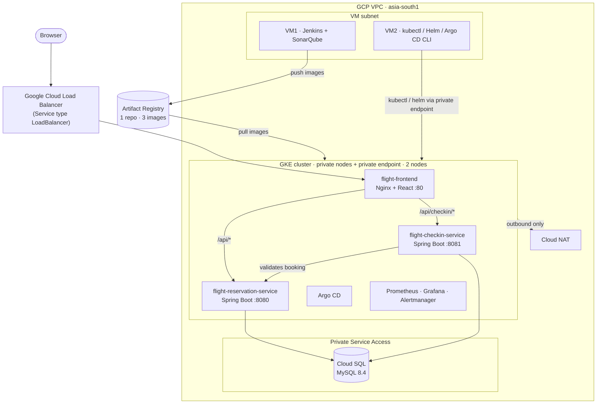
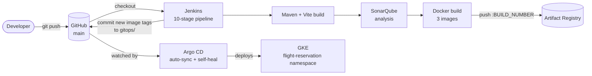

# ✈️ Flight Reservation System — End-to-End DevOps on Google Cloud

A full-stack **flight booking and check-in platform** (React + two Spring Boot microservices) that is provisioned with **Terraform**, built by **Jenkins**, scanned by **SonarQube**, stored in **Artifact Registry**, delivered to **Google Kubernetes Engine (GKE)** through **Argo CD (GitOps)**, and observed with **Prometheus, Grafana and Cloud Monitoring**.

The application is the vehicle; the focus of this repository is the **production-style GCP DevOps pipeline around it** — everything from creating the VPC to rolling a new container image onto the cluster is automated.

<p align="center">
  
</p>

<p align="center">
  
  
  
  
  
  
  
  
  
  
  
  
  
</p>

---

## At a glance

**What this project demonstrates**

- **Infrastructure as Code** — 11 modular Terraform modules create the whole GCP environment (VPC, Compute Engine, GKE, Cloud SQL, Cloud Storage, Artifact Registry, IAM, Cloud NAT, notifications, Cloud Monitoring).
- **CI pipeline** — a 10-stage Jenkins pipeline: verify GCP → build → SonarQube analysis → Docker build → push to Artifact Registry → update GitOps manifests.
- **GitOps continuous delivery** — Argo CD watches the `gitops/` folder and auto-syncs, self-heals and prunes the GKE namespace.
- **Observability & alerting** — `kube-prometheus-stack` (Prometheus, Grafana, Alertmanager) inside the cluster, plus Cloud Monitoring alert policies that email the administrator.
- **Security-minded design** — private GKE nodes *and* private control-plane endpoint, Cloud SQL on a private IP only, admin-IP-only firewall rules, service accounts instead of stored keys, Workload Identity enabled, shielded VMs, non-root backend containers.

| | |
|---|---|
| **Cloud / region** | Google Cloud · `asia-south1` (Mumbai) |
| **Kubernetes** | GKE (zonal, private, VPC-native) · 2 × `e2-standard-2` worker nodes · REGULAR release channel |
| **Database** | Cloud SQL for MySQL 8.4 (private IP, automated backups, storage autoresize) |
| **CI** | Jenkins on Compute Engine · 10 stages |
| **CD** | Argo CD — automated sync, self-heal, prune |
| **Observability** | Prometheus · Grafana · Alertmanager · Cloud Monitoring → email |
| **IaC** | Terraform ≥ 1.6 · `hashicorp/google` provider ~> 7.30 |

> This is the **GCP edition** of the [flight-reservation-multicloud](../README.md) project. The application code and UI are shared with the AWS and Azure editions; the infrastructure, pipeline and deployment layer in this folder are specific to Google Cloud.

---

## Table of contents

- [Features](#features)
- [Architecture](#architecture)
- [Tech stack](#tech-stack)
- [Screenshots](#screenshots)
- [CI/CD pipeline](#cicd-pipeline-jenkins--artifact-registry)
- [GitOps deployment](#gitops-deployment-argo-cd--gke)
- [Infrastructure (Terraform)](#infrastructure-terraform)
- [AWS → GCP service mapping](#aws--gcp-service-mapping)
- [Monitoring & alerting](#monitoring--alerting)
- [Repository layout](#repository-layout)
- [API reference](#api-reference)
- [Run locally](#run-locally)
- [Deploy to GCP](#deploy-to-gcp)
- [Security notes](#security-notes)
- [Roadmap](#roadmap)
- [Author](#author)

---

## Features

**Traveller**
- Register and log in (JWT authentication)
- Search flights by origin, destination and date
- Book a flight through a (simulated) payment step
- View personal bookings and **download a PDF e-ticket** (generated with iTextPDF)
- View and update profile
- **Online check-in** with baggage count, handled by a separate check-in service

**Admin**
- Separate admin login and profile
- Add and delete flights, and view the full flight list
- Add admin accounts and view the admin list

**Platform**
- Stateless JWT auth shared across two independent Spring Boot services
- The check-in service validates the booking (and that it belongs to the caller) by calling the reservation service
- Nginx reverse proxy gives the browser a single origin, so the SPA never deals with CORS or service addresses
- Fully automated build → scan → image → deploy flow with self-healing GitOps

---

## Architecture



The frontend is served by **Nginx on port 80** and is the only entry point for the browser. It reverse-proxies:

| Path | Target |
|---|---|
| `/api/checkin/*` | `flight-checkin-service:8081` |
| `/api/*` | `flight-reservation-service:8080` |
| everything else | React static build (SPA fallback to `index.html`) |

### Delivery flow



---

## Tech stack

| Layer | Technology |
|---|---|
| Frontend | React 19, Vite 6, React Router 7, Redux Toolkit, Axios, React Toastify |
| Reservation service | Java 21, Spring Boot 3.3.5, Spring Security, Spring Data JPA, JJWT, iTextPDF |
| Check-in service | Java 21, Spring Boot 3.3.5, Spring Security, Spring Data JPA, JJWT |
| Database | Cloud SQL for MySQL 8.4 |
| Containers | Docker · Nginx 1.29 (frontend) · Eclipse Temurin 21 JRE Alpine (backends, non-root user) |
| Infrastructure as Code | Terraform — modules: `apis`, `network`, `firewall`, `iam`, `compute-vm` (×2), `gke`, `cloudsql`, `gcs`, `artifact-registry`, `notifications`, `cloud-monitoring` |
| Cloud | Google Cloud — VPC, Compute Engine, GKE, Cloud SQL, Cloud Storage, Artifact Registry, IAM, Cloud NAT, Cloud Monitoring |
| CI | Jenkins, Maven, npm, SonarQube (Community) |
| CD / GitOps | Argo CD, Kubernetes manifests + Kustomize |
| Monitoring | kube-prometheus-stack (Prometheus, Grafana, Alertmanager, node-exporter, kube-state-metrics) via Helm, plus Cloud Monitoring alert policies |

---

## Screenshots

### Application

<table>
  <tr>
    <td align="center"><br><sub><b>Login</b></sub></td>
    <td align="center"><br><sub><b>Register</b></sub></td>
    <td align="center"><br><sub><b>Profile</b></sub></td>
  </tr>
  <tr>
    <td align="center"><br><sub><b>Search &amp; book flights</b></sub></td>
    <td align="center"><br><sub><b>My bookings + PDF ticket</b></sub></td>
    <td align="center"><br><sub><b>Contact</b></sub></td>
  </tr>
</table>

> 📸 **GCP screenshots are not captured yet.** After you deploy, add yours (Terraform apply, GKE workloads, Cloud SQL, Jenkins, Argo CD, Grafana, Cloud Monitoring) to [`../docs/screenshots/gcp/`](../docs/screenshots/gcp/) — see the checklist there — and reference them here.

---

## CI/CD pipeline (Jenkins + Artifact Registry)

The [`Jenkinsfile`](./Jenkinsfile) (Jenkins job *Script Path*: `gcp/Jenkinsfile`) runs on the Terraform-provisioned Jenkins VM (VM1). It uses `timestamps()`, `disableConcurrentBuilds()` and a 60-minute timeout.

| # | Stage | What it does |
|---|---|---|
| 1 | **Verify GCP** | Reads the project ID from the metadata server, prints the active identity and confirms the Artifact Registry repository exists |
| 2 | **Backend Build** | `mvn clean package` for the reservation and check-in services |
| 3 | **Frontend Build** | `npm ci` + `npm run build` (Vite), API base path set to `/api` |
| 4 | **SonarQube Analysis** | `mvn sonar:sonar` for both backends using the `sonarqube-token` credential |
| 5 | **Docker Build** | Builds the three images (reservation, check-in, frontend) |
| 6 | **Artifact Registry Login** | `gcloud auth print-access-token \| docker login` using the VM's service account |
| 7 | **Tag Images** | Tags images as `<region>-docker.pkg.dev/<project>/flight-reservation-dev/<image>:<BUILD_NUMBER>` |
| 8 | **Push Images** | Pushes the three immutable, build-numbered tags |
| 9 | **Update GitOps** | Rewrites the `image:` lines in `gitops/*-deployment.yaml`, commits and pushes to `main` |
| 10 | **Docker Cleanup** | Removes local images and prunes dangling layers |

**Credentials** ([`docs/JENKINS-CREDENTIALS.md`](./docs/JENKINS-CREDENTIALS.md)):

- `sonarqube-token` — SonarQube token (secret text)
- `github` — GitHub username + PAT, used by the *Update GitOps* stage to push back to `main`
- **No Google Cloud keys are stored in Jenkins** — Artifact Registry access comes from the VM1 service account, scoped to the one repository.

---

## GitOps deployment (Argo CD + GKE)

The [`gitops/`](./gitops) folder holds the Kubernetes manifests for the `flight-reservation` namespace:

| Manifest | Purpose |
|---|---|
| `namespace.yaml` | `flight-reservation` namespace |
| `configmap.yaml` | Cloud SQL JDBC URLs, in-cluster booking-service URL, frontend URL |
| `reservation-deployment.yaml` / `-service.yaml` | Reservation backend, port 8080 |
| `checkin-deployment.yaml` / `-service.yaml` | Check-in backend, port 8081 |
| `frontend-deployment.yaml` / `-service.yaml` | Nginx + React, exposed with a `LoadBalancer` Service on port 80 |
| `secret.example.yaml` | Template for DB credentials (applied by hand, deliberately **not** part of `kustomization.yaml`, so Argo CD never overwrites it) |

Each backend Deployment sets CPU/memory requests and limits and has liveness and readiness probes. The database is **not** a pod — the services connect to the private Cloud SQL instance.

[`argocd-application.yaml`](./argocd-application.yaml) points Argo CD at `gitops/` on `main` with **automated sync, self-heal and prune**, so a Jenkins image-tag commit is rolled out automatically and any manual `kubectl` drift is reverted.

```bash
kubectl apply -f argocd-application.yaml
argocd app get flight-reservation
argocd app sync flight-reservation
```

---

## Infrastructure (Terraform)

Everything lives in [`terraform/`](./terraform) and is split into modules wired together in `main.tf`.

| Module | Provisions |
|---|---|
| `apis` | Enables the required Google APIs |
| `network` | Custom-mode VPC, VM subnet `10.0.1.0/24`, GKE subnet `10.0.11.0/24` with Pod/Service secondary ranges, Cloud Router + Cloud NAT, Private Service Access range + peering for Cloud SQL |
| `firewall` | Jenkins rule (SSH 22, Jenkins 8080, SonarQube 9000 — **admin IP only**), monitoring-VM SSH (admin IP only), optional IAP SSH, internal traffic, GKE control-plane → node webhook ports |
| `iam` | Service accounts for Jenkins, the monitoring VM and GKE nodes, each with only the roles it needs |
| `compute-vm` | Used twice — VM1 `flight-reservation-dev-jenkins` (Docker, Jenkins, Maven, Java 21, Node 22, gcloud, SonarQube container) and VM2 `flight-reservation-dev-monitoring` (gcloud, kubectl, Helm, Argo CD CLI, MySQL client). Static IPs, shielded VM, OS Login, Ops Agent |
| `gke` | Cluster `flight-reservation-dev-gke` — zonal, VPC-native, **private nodes and private control-plane endpoint**, Workload Identity, managed node pool of 2 × `e2-standard-2` |
| `cloudsql` | MySQL 8.4 (Enterprise edition), **private IP only**, SSD, storage autoresize to 100 GB, automated backups; creates both `flightdb` and `checkin_db` plus the application user |
| `gcs` | Application-files bucket with versioning, uniform access and public access prevention enforced |
| `artifact-registry` | Docker repository `flight-reservation-dev`; Jenkins may push, GKE nodes may pull (granted on the repository, not the project) |
| `notifications` | Email notification channel |
| `cloud-monitoring` | Alert policies: Jenkins CPU, monitoring-VM CPU, Cloud SQL CPU (threshold 80 %) and Cloud SQL disk utilization (> 85 %) |

Helper scripts in [`terraform/scripts/`](./terraform/scripts): `install-argocd.sh`, `install-monitoring.sh`, `verify-cloudsql.sh`, plus the VM startup scripts. Details: [`terraform/README.md`](./terraform/README.md).

---

## AWS → GCP service mapping

| AWS (previous edition) | GCP (this edition) |
|---|---|
| VPC, public/private/database subnets, NAT Gateway | Custom VPC, VM subnet, GKE subnet, Cloud NAT, Private Service Access |
| Security groups | VPC firewall rules (network tags) |
| IAM roles / instance profiles | Service accounts attached to VMs and nodes |
| EC2 (Jenkins, monitoring) | Compute Engine |
| EKS (private endpoint) | GKE (private nodes + private endpoint) |
| RDS MariaDB 10.11 | **Cloud SQL for MySQL 8.4** (Cloud SQL has no MariaDB) |
| S3 | Cloud Storage |
| ECR (3 repositories) | Artifact Registry (1 repository, 3 images) |
| SNS email topic | Cloud Monitoring email notification channel |
| CloudWatch alarms | Cloud Monitoring alert policies |
| `aws eks update-kubeconfig` | `gcloud container clusters get-credentials --internal-ip` |

---

## Monitoring & alerting

- **In-cluster metrics** — `kube-prometheus-stack` is installed into the GKE cluster from VM2 with Helm, so Prometheus, Grafana, Alertmanager, node-exporter and kube-state-metrics run next to the workloads they watch. Values: [`monitoring/`](./monitoring) (Grafana as `ClusterIP`, admin password from a Kubernetes Secret; GKE-managed control-plane scraping disabled).
- **GCP-level alerts** — Cloud Monitoring alert policies on the two VMs and on Cloud SQL email the administrator.

```bash
# on VM2
./terraform/scripts/install-monitoring.sh
kubectl -n monitoring port-forward svc/kube-prometheus-stack-grafana 3000:80
```

---

## Repository layout

This folder is one of three cloud editions inside the **flight-reservation-multicloud** repository. The application code is shared and lives at the repository root; everything in this folder is specific to Google Cloud.

```
flight-reservation-multicloud/
├── frontend/ · FlightReservationApplication/ · FlightCheckInApplication/   # shared application (same code on every cloud)
├── gcp/                              # <- this edition
│   ├── terraform/                    # GCP infrastructure (11 modules) + helper scripts
│   ├── gitops/                       # Kubernetes manifests synced by Argo CD
│   ├── monitoring/                   # kube-prometheus-stack values + Grafana secret template
│   ├── docs/                         # Jenkins credentials setup
│   ├── Jenkinsfile                   # CI pipeline (Jenkins job Script Path: gcp/Jenkinsfile)
│   ├── argocd-application.yaml       # Argo CD Application definition
│   ├── README-DEPLOYMENT.md          # Detailed one-time deployment notes
│   └── README.md                     # this file
├── aws/  azure/  gcp/                # the three editions
└── docs/screenshots/                 # every screenshot used in the READMEs
```

---

## API reference

All endpoints except `register` and `login` require a JWT: `Authorization: Bearer <token>`.

### Users — `/api/users` (reservation service)

| Method | Endpoint | Description |
|---|---|---|
| POST | `/register` | Register a user (public) |
| POST | `/login` | Authenticate and receive a JWT (public) |
| GET | `/{id}` | Get a user by ID |
| GET | `/userList` | List registered users |
| PUT | `/update/{id}` | Update a user's profile |

### Flights — `/api/flights` (reservation service)

| Method | Endpoint | Description |
|---|---|---|
| POST | `/create` | Add a flight |
| GET | `/all` | List all flights |
| GET | `/search?origin=&destination=&departureDate=` | Search flights |
| PUT | `/update/{id}` | Update a flight |
| DELETE | `/delete/{id}` | Delete a flight |

### Bookings — `/api/bookings` (reservation service)

| Method | Endpoint | Description |
|---|---|---|
| POST | `/book` | Create a booking |
| GET | `/user/{userId}` | List a user's bookings |
| GET | `/details/{bookingId}` | Get one booking |
| GET | `/download-ticket/{bookingId}` | Download the PDF e-ticket |

### Check-in — `/api/checkin` (check-in service)

| Method | Endpoint | Description |
|---|---|---|
| POST | `/{bookingId}?numberOfBags=` | Check in a booking. The service calls the reservation service to confirm the booking exists and belongs to the caller |

---

## Run locally

The application is identical on every cloud, so the local-run instructions live once in the [root README](../README.md#run-locally).

---

## Deploy to GCP

> ⚠️ This creates billable resources (GKE, Cloud NAT, 4 × `e2-standard-2`, Cloud SQL, static IPs). Run `terraform destroy` when you are done.

> **Working directory:** run the commands in this section from the `gcp/` folder of the repository unless a step says otherwise. In Jenkins, set the pipeline job's *Script Path* to `gcp/Jenkinsfile` and edit the repository name inside it where noted.

**0. Prerequisites** — a GCP project with billing enabled, the `gcloud` CLI and Terraform ≥ 1.6. Authenticate and enable the two bootstrap APIs (details in [`terraform/GCP-CREDENTIALS.md`](./terraform/GCP-CREDENTIALS.md)):

```bash
gcloud auth login && gcloud auth application-default login
gcloud config set project YOUR_PROJECT_ID
gcloud services enable serviceusage.googleapis.com cloudresourcemanager.googleapis.com
```

**1. Provision the infrastructure**

```bash
cd terraform
cp terraform.tfvars.example terraform.tfvars    # then edit: project_id, admin_cidr, sql_password, alert_email
terraform init && terraform validate
terraform plan
terraform apply
```

Confirm the verification email Google sends to `alert_email`. Cloud SQL and its private networking can take 10–15 minutes.

**2. Connect to VM2 (inside the VPC) and set up the cluster**

```bash
gcloud compute ssh flight-reservation-dev-monitoring --zone asia-south1-a --tunnel-through-iap
# on VM2:
git clone https://github.com/YOUR_GITHUB_USER/flight-reservation-multicloud.git && cd flight-reservation-multicloud/gcp
DB_HOST=<cloudsql_private_ip> DB_USER=flightadmin DB_PASSWORD=<password> ./terraform/scripts/verify-cloudsql.sh
./terraform/scripts/install-argocd.sh
```

(The VM bootstrap scripts take a few minutes after first boot; check `sudo journalctl -u google-startup-scripts.service`.)

**3. Configure Jenkins on VM1** — open `http://<jenkins_public_ip>:8080`, unlock it with `sudo cat /var/lib/jenkins/secrets/initialAdminPassword`, add the `sonarqube-token` and `github` credentials, define a SonarQube server named `Sonarqube`, and create a Pipeline job from SCM with *Script Path* `gcp/Jenkinsfile` and set `GITHUB_REPO` at the top of that file to your `owner/repo` (see [`docs/JENKINS-CREDENTIALS.md`](./docs/JENKINS-CREDENTIALS.md)).

**4. Fill in the environment values**

- `gitops/configmap.yaml` — set the Cloud SQL private IP (`terraform output cloudsql_private_ip`); set `FRONTEND_URL` once the load balancer address is known.
- Create the DB credentials Secret from the template and apply it by hand (on VM2):

```bash
cp gitops/secret.example.yaml gitops/secret.yaml     # edit with the real Cloud SQL credentials
kubectl create namespace flight-reservation
kubectl apply -f gitops/secret.yaml
```

**5. First release** — run the Jenkins pipeline so Artifact Registry contains images and the GitOps manifests point at them, then hand control to Argo CD:

```bash
kubectl apply -f argocd-application.yaml
kubectl get svc flight-frontend -n flight-reservation     # public address of the app
```

Put that address into `FRONTEND_URL` in `gitops/configmap.yaml`, push, and restart the backends so they pick it up: `kubectl rollout restart deployment -n flight-reservation`.

**6. Install monitoring**

```bash
./terraform/scripts/install-monitoring.sh
```

From here on, every push that goes through Jenkins is rolled out to the cluster automatically. More detail is in [`README-DEPLOYMENT.md`](./README-DEPLOYMENT.md).

---

## Security notes

- **Network** — the GKE nodes are private and the control-plane endpoint is private (reachable only from inside the VPC via VM2); Cloud SQL has no public IP; Jenkins/SonarQube/SSH are open only to the administrator's IP (or via IAP).
- **Credentials at runtime** — the backends receive `SPRING_DATASOURCE_USERNAME` / `SPRING_DATASOURCE_PASSWORD` from a Kubernetes Secret and the JDBC URL from a ConfigMap. The Secret is applied manually and is intentionally excluded from the GitOps kustomization.
- **Google Cloud access** — Jenkins, the monitoring VM and the GKE nodes use their own service accounts; no service account keys are stored in Jenkins or in Git. Artifact Registry permissions are granted on the repository, not the project.
- **Containers and hosts** — backend images run as a non-root user; VMs use Shielded VM and OS Login.
- **Demo defaults** — the seeded `admin` account, the simulated payment page and the JWT signing secret in the Spring Boot source are for demonstration only; move the JWT secret to a Kubernetes Secret (or Secret Manager) before real use.

---

## Roadmap

Ideas for taking this further:

- Run unit tests in the Jenkins pipeline (currently skipped for faster builds) and publish JaCoCo coverage to SonarQube
- Work through the open SonarQube findings
- Enforce `ROLE_ADMIN` at the API layer for `/api/flights/**` (admin actions are currently hidden in the UI; the API requires a valid JWT)
- Remote Terraform state in Cloud Storage (`terraform/backend.tf.example` is included) and a separate staging environment
- Ingress with a Google-managed TLS certificate (GKE Ingress / Gateway API) instead of a plain `LoadBalancer` Service; add HPAs
- Workload Identity + Secret Manager for database credentials instead of a hand-applied Kubernetes Secret
- Cloud SQL Auth Proxy sidecar instead of direct private-IP connections
- Enable Spring Boot Actuator/Micrometer and a `ServiceMonitor` so Prometheus scrapes application metrics, not only cluster metrics
- `docker-compose.yml` for a one-command local stack

---

## Author

**Anurag Patil** — DevOps Engineer

- GitHub: [@AnuragPatil-cloud](https://github.com/AnuragPatil-cloud)
- Email: [anurag.patil.devops@gmail.com](mailto:anurag.patil.devops@gmail.com)
